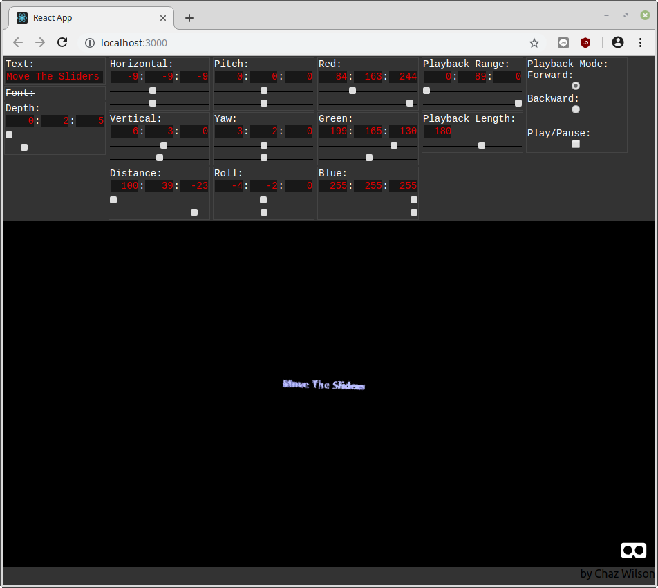
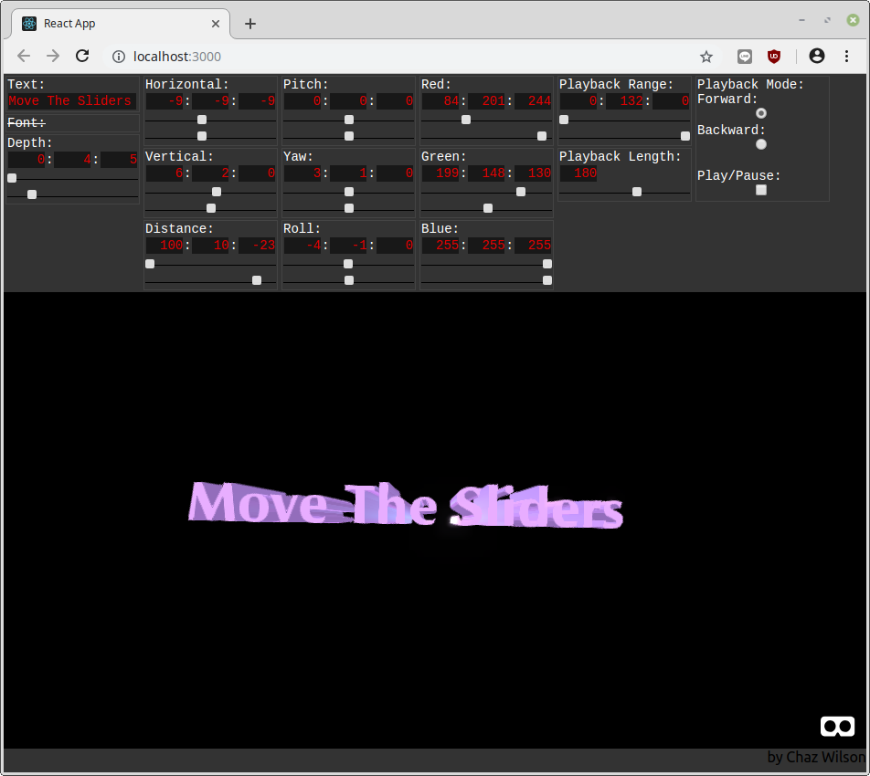
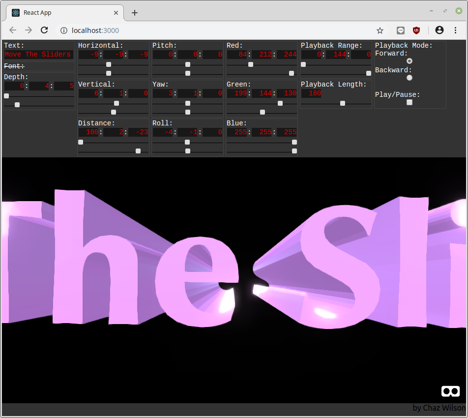
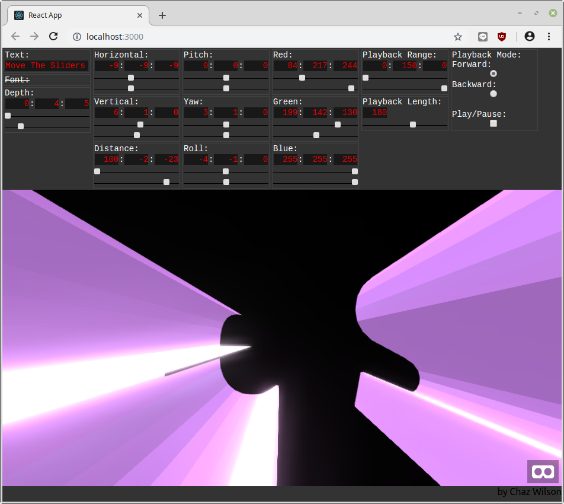
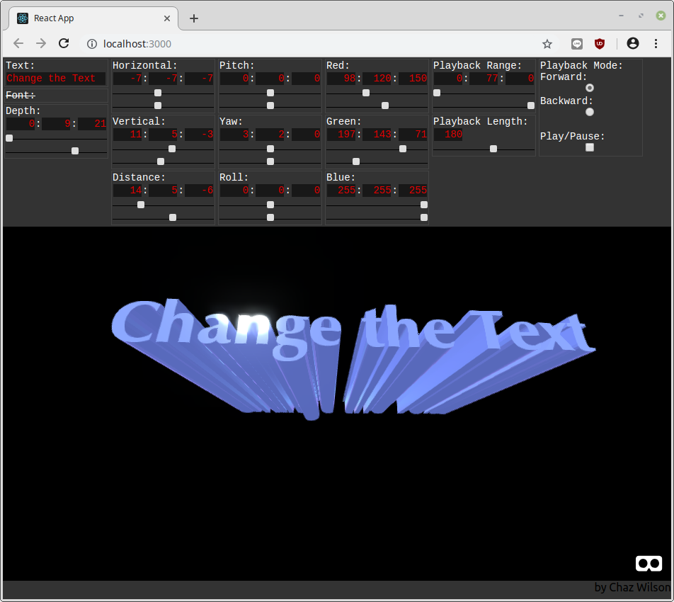
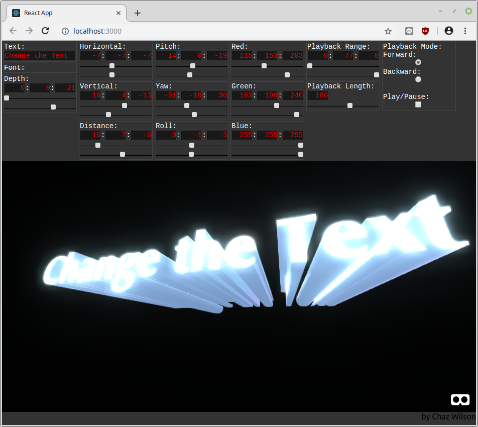

## About 3D Text Synthesizer

3D Text Synthesizer is a program to make your text _fun_ and _exciting_. It is inspired by the television graphics of the late-seventies through mid-eighties; typically made with low powered computers and analog video synthesizers (such as the Scanimate).

This project was made using Javascript, A-Frame, React and Redux.

### How to Install

You will need to have yarn installed in order to follow these directions.

* `git clone https://github.com/chaz303/3D-Text-Synthesizer.git`
* `cd 3D-Text-Synthesizer/`
* `yarn`
* `yarn start`

### How to Use

The idea behind this app is to make animating text as easy and fun as possible. Below the text prompt enter your text. Adjust the upper "Horizontal" slider as needed to center the text (if desired). The upper "Horizontal" slider is the starting horizontal value and the lower "Horizontal" slider is the ending horizontal value. When played back Zexty Ext will make animate between those two values. The same can be done with every one of the settings available.

The "In/Out" toggle toggles between the start and end positions for all of the settings. This toggle only works when play back is stopped.

### Screenshots

