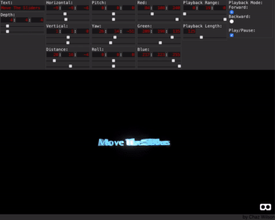

## About 3D Text Synthesizer

3D Text Synthesizer is deigned to make animating text easy and fun. It is inspired by the television graphics of the late-seventies through mid-eighties; typically made with low powered computers and analog video synthesizers (such as the Scanimate).

This project was made using Javascript, A-Frame, React and Redux.

&nbsp; &nbsp; &nbsp; &nbsp; &nbsp; &nbsp; &nbsp; &nbsp;
&nbsp; &nbsp; &nbsp; &nbsp; &nbsp; &nbsp; &nbsp; &nbsp;

### How to Install

You will need to have yarn installed in order to follow these directions.

* `git clone https://github.com/chaz303/3d-text-synthesizer.git`
* `cd 3d-text-synthesizer/`
* `yarn`
* `yarn start`

### How to Use

* Below the text prompt (in the upper left corner) enter your text. By default it reads "Move the Sliders."
* Adjust the upper "Horizontal" slider as needed to center the text (then make the lower "Horizontal" value the same as the upper one.).
   * The upper "Horizontal" slider is the starting horizontal value and the lower "Horizontal" slider is the ending horizontal value. If the values of both are the same, then there will be no change.
   
* When played 3D Text Synthesizer will make animate the changes between any and all of the upper and lower slider value pairs.

### Screenshots

  
&nbsp; &nbsp; &nbsp; &nbsp; 

